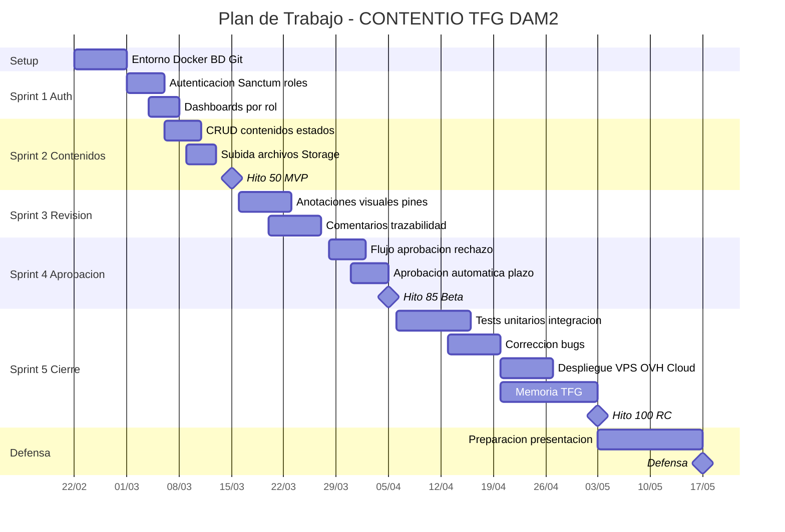

````markdown
# Plan de Trabajo - CONTENTIO TFG DAM2


```mermaid
gantt
    title Plan de Trabajo - CONTENTIO TFG DAM2
    dateFormat YYYY-MM-DD
    axisFormat %d/%m

    section Setup
    Entorno Docker BD Git :s0, 2026-02-22, 7d

    section Sprint 1 Auth
    Autenticacion Sanctum roles :s1a, 2026-03-01, 5d
    Dashboards por rol :s1b, 2026-03-04, 4d

    section Sprint 2 Contenidos
    CRUD contenidos estados :s2a, 2026-03-06, 5d
    Subida archivos Storage :s2b, 2026-03-09, 4d
    Hito 50 MVP :milestone, m1, 2026-03-15, 0d

    section Sprint 3 Revision
    Anotaciones visuales pines :s3a, 2026-03-16, 7d
    Comentarios trazabilidad :s3b, 2026-03-20, 7d

    section Sprint 4 Aprobacion
    Flujo aprobacion rechazo :s4a, 2026-03-28, 5d
    Aprobacion automatica plazo :s4b, 2026-03-31, 5d
    Hito 85 Beta :milestone, m2, 2026-04-05, 0d

    section Sprint 5 Cierre
    Tests unitarios integracion :s5a, 2026-04-06, 10d
    Correccion bugs :s5b, 2026-04-13, 7d
    Despliegue VPS OVH Cloud :s5c, 2026-04-20, 7d
    Memoria TFG :s5d, 2026-04-20, 13d
    Hito 100 RC :milestone, m3, 2026-05-03, 0d

    section Defensa
    Preparacion presentacion :s6, 2026-05-03, 14d
    Defensa :milestone, m4, 2026-05-17, 0d
```
````
