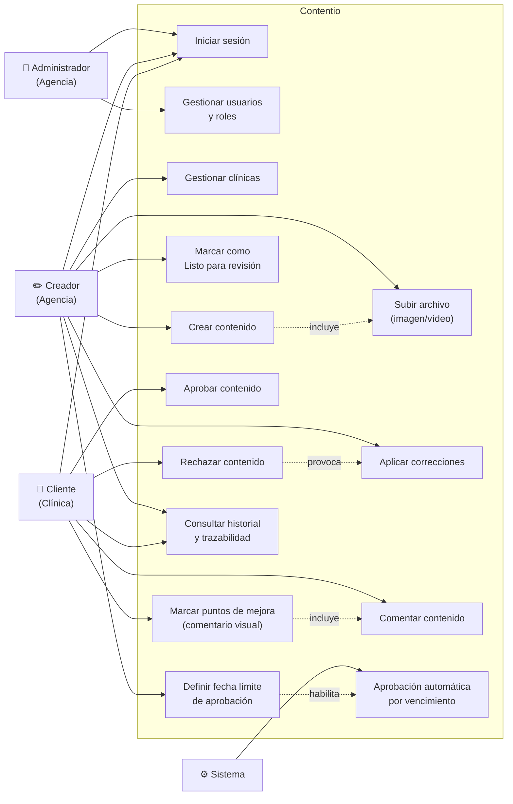

# Casos de Uso — Contentio

```mermaid
flowchart LR
    Admin["🔧 Administrador\n(Agencia)"]
    Creator["✏️ Creador\n(Agencia)"]
    Client["👤 Cliente\n(Clínica)"]
    System["⚙️ Sistema"]

    subgraph Contentio
        UC_Login["Iniciar sesión"]
        UC_Users["Gestionar usuarios\ny roles"]
        UC_Clinics["Gestionar clínicas"]
        UC_CreateContent["Crear contenido"]
        UC_Upload["Subir archivo\n(imagen/vídeo)"]
        UC_ReadyReview["Marcar como\nListo para revisión"]
        UC_Fix["Aplicar correcciones"]
        UC_Comment["Comentar contenido"]
        UC_Annotate["Marcar puntos de mejora\n(comentario visual)"]
        UC_Approve["Aprobar contenido"]
        UC_Reject["Rechazar contenido"]
        UC_Deadline["Definir fecha límite\nde aprobación"]
        UC_AutoApprove["Aprobación automática\npor vencimiento"]
        UC_History["Consultar historial\ny trazabilidad"]
    end

    Admin --> UC_Login
    Admin --> UC_Users

    Creator --> UC_Login
    Creator --> UC_Clinics
    Creator --> UC_CreateContent
    Creator --> UC_Upload
    Creator --> UC_ReadyReview
    Creator --> UC_Fix
    Creator --> UC_Deadline
    Creator --> UC_History

    Client --> UC_Login
    Client --> UC_Comment
    Client --> UC_Annotate
    Client --> UC_Approve
    Client --> UC_Reject
    Client --> UC_History

    System --> UC_AutoApprove

    UC_CreateContent -.->|incluye| UC_Upload
    UC_Annotate -.->|incluye| UC_Comment
    UC_Reject -.->|provoca| UC_Fix
    UC_Deadline -.->|habilita| UC_AutoApprove
```
