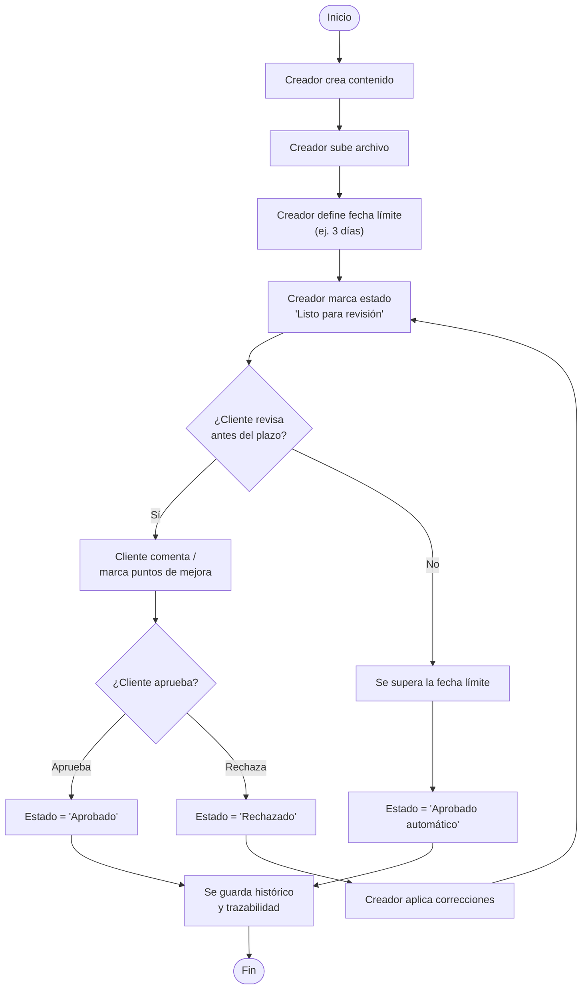

# Diagrama de Actividad — Flujo de revisión de contenido

```mermaid
flowchart TD
    A([Inicio]) --> B["Creador crea contenido"]
    B --> C["Creador sube archivo"]
    C --> D["Creador define fecha límite\n(ej. 3 días)"]
    D --> E["Creador marca estado\n'Listo para revisión'"]
    E --> F{"¿Cliente revisa\nantes del plazo?"}

    F -->|Sí| G["Cliente comenta /\nmarca puntos de mejora"]
    G --> H{"¿Cliente aprueba?"}

    H -->|Aprueba| I["Estado = 'Aprobado'"]
    H -->|Rechaza| J["Estado = 'Rechazado'"]
    J --> K["Creador aplica correcciones"]
    K --> E

    F -->|No| L["Se supera la fecha límite"]
    L --> M["Estado = 'Aprobado automático'"]

    I --> N["Se guarda histórico\ny trazabilidad"]
    M --> N
    N --> O([Fin])
```
