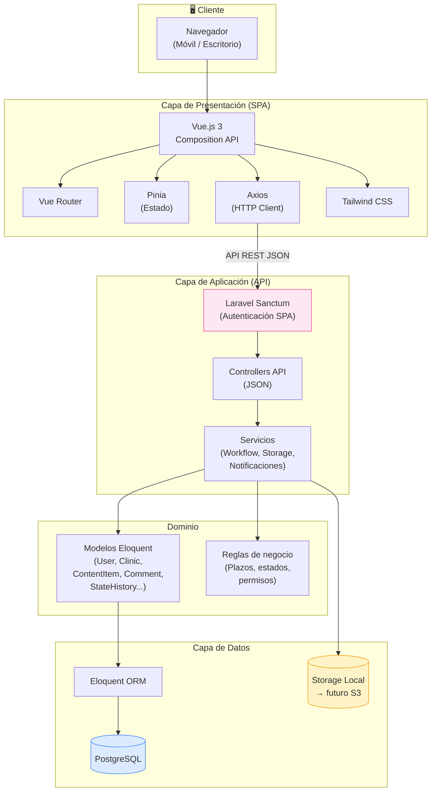

# Arquitectura por Capas — Contentio

```mermaid
flowchart TD
    subgraph Cliente["🖥️ Cliente"]
        Browser["Navegador\n(Móvil / Escritorio)"]
    end

    subgraph Presentacion["Capa de Presentación (SPA)"]
        Vue["Vue.js 3\nComposition API"]
        Router["Vue Router"]
        Pinia["Pinia\n(Estado)"]
        Axios["Axios\n(HTTP Client)"]
        TW["Tailwind CSS"]
    end

    subgraph Aplicacion["Capa de Aplicación (API)"]
        Controllers["Controllers API\n(JSON)"]
        Services["Servicios\n(Workflow, Storage,\nNotificaciones)"]
        Sanctum["Laravel Sanctum\n(Autenticación SPA)"]
    end

    subgraph Dominio["Dominio"]
        Models["Modelos Eloquent\n(User, Clinic,\nContentItem, Comment,\nStateHistory...)"]
        Rules["Reglas de negocio\n(Plazos, estados,\npermisos)"]
    end

    subgraph Datos["Capa de Datos"]
        Eloquent["Eloquent ORM"]
        DB[("PostgreSQL")]
        Storage[("Storage Local\n→ futuro S3")]
    end

    Browser --> Vue
    Vue --> Router
    Vue --> Pinia
    Vue --> Axios
    Vue --> TW
    Axios -->|API REST JSON| Sanctum
    Sanctum --> Controllers
    Controllers --> Services
    Services --> Models
    Services --> Rules
    Models --> Eloquent
    Eloquent --> DB
    Services --> Storage

    style DB fill:#dbeafe,stroke:#3b82f6
    style Storage fill:#fef3c7,stroke:#f59e0b
    style Sanctum fill:#fce7f3,stroke:#ec4899
```
