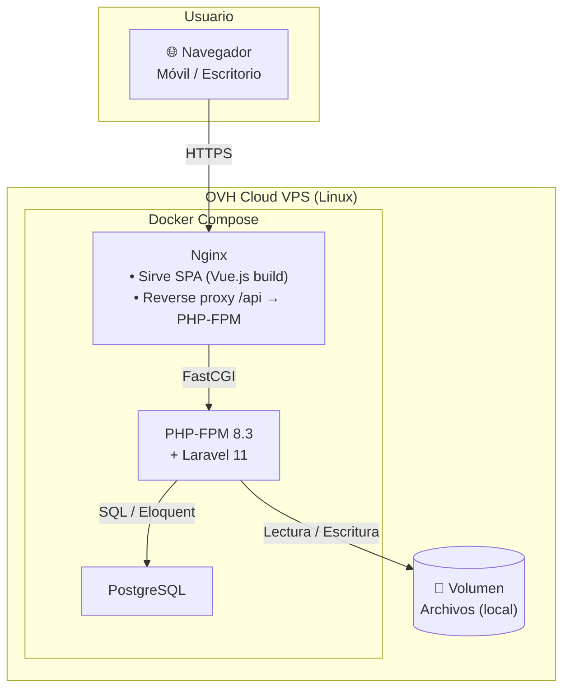

# Diagrama de Despliegue — Contentio

```mermaid
flowchart TD
    subgraph Usuario
        Browser["🌐 Navegador\nMóvil / Escritorio"]
    end

    subgraph VPS["OVH Cloud VPS (Linux)"]
        subgraph Docker["Docker Compose"]
            Nginx["Nginx\n• Sirve SPA (Vue.js build)\n• Reverse proxy /api → PHP-FPM"]
            PHP["PHP-FPM 8.3\n+ Laravel 11"]
            PG["PostgreSQL"]
        end
        Files[("📁 Volumen\nArchivos (local)")]
    end

    Browser -->|HTTPS| Nginx
    Nginx -->|FastCGI| PHP
    PHP -->|SQL / Eloquent| PG
    PHP -->|Lectura / Escritura| Files
```

> **Nota:** El almacenamiento local está preparado para migrar a Object Storage S3 (Cloudflare R2) en el futuro gracias a Laravel Storage.
