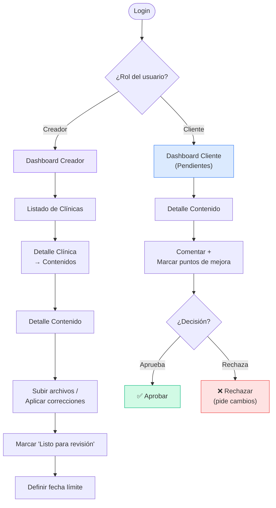

# Flujo de Navegación — Contentio

```mermaid
flowchart TD
    A([Login]) --> B{"¿Rol del usuario?"}

    B -->|Creador| C["Dashboard Creador"]
    C --> D["Listado de Clínicas"]
    D --> E["Detalle Clínica\n→ Contenidos"]
    E --> F["Detalle Contenido"]
    F --> G["Subir archivos /\nAplicar correcciones"]
    G --> H["Marcar 'Listo para revisión'"]
    H --> I["Definir fecha límite"]

    B -->|Cliente| J["Dashboard Cliente\n(Pendientes)"]
    J --> K["Detalle Contenido"]
    K --> L["Comentar +\nMarcar puntos de mejora"]
    L --> M{"¿Decisión?"}
    M -->|Aprueba| N["✅ Aprobar"]
    M -->|Rechaza| O["❌ Rechazar\n(pide cambios)"]

    style N fill:#d1fae5,stroke:#10b981
    style O fill:#fee2e2,stroke:#ef4444
    style C fill:#ede9fe,stroke:#8b5cf6
    style J fill:#dbeafe,stroke:#3b82f6
```
