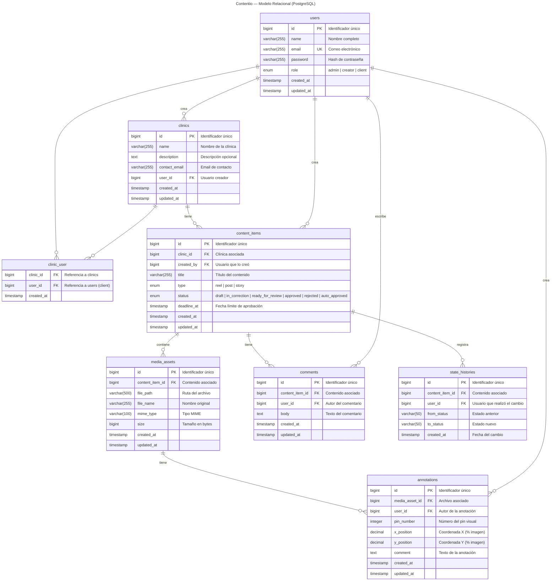

# Modelo de Base de Datos — Contentio

```mermaid
---
title: Contentio — Modelo Relacional (PostgreSQL)
---
erDiagram

    %% ═══════════════════════════════════════
    %% NÚCLEO: Usuarios y Clínicas
    %% ═══════════════════════════════════════

    users {
        bigint id PK "Identificador único"
        varchar(255) name "Nombre completo"
        varchar(255) email UK "Correo electrónico"
        varchar(255) password "Hash de contraseña"
        enum role "admin | creator | client"
        timestamp created_at
        timestamp updated_at
    }

    clinics {
        bigint id PK "Identificador único"
        varchar(255) name "Nombre de la clínica"
        text description "Descripción opcional"
        varchar(255) contact_email "Email de contacto"
        bigint user_id FK "Usuario creador"
        timestamp created_at
        timestamp updated_at
    }

    clinic_user {
        bigint clinic_id FK "Referencia a clinics"
        bigint user_id FK "Referencia a users (client)"
        timestamp created_at
    }

    %% ═══════════════════════════════════════
    %% CONTENIDOS Y MULTIMEDIA
    %% ═══════════════════════════════════════

    content_items {
        bigint id PK "Identificador único"
        bigint clinic_id FK "Clínica asociada"
        bigint created_by FK "Usuario que lo creó"
        varchar(255) title "Título del contenido"
        enum type "reel | post | story"
        enum status "draft | in_correction | ready_for_review | approved | rejected | auto_approved"
        timestamp deadline_at "Fecha límite de aprobación"
        timestamp created_at
        timestamp updated_at
    }

    media_assets {
        bigint id PK "Identificador único"
        bigint content_item_id FK "Contenido asociado"
        varchar(500) file_path "Ruta del archivo"
        varchar(255) file_name "Nombre original"
        varchar(100) mime_type "Tipo MIME"
        bigint size "Tamaño en bytes"
        timestamp created_at
        timestamp updated_at
    }

    %% ═══════════════════════════════════════
    %% REVISIÓN Y TRAZABILIDAD
    %% ═══════════════════════════════════════

    comments {
        bigint id PK "Identificador único"
        bigint content_item_id FK "Contenido asociado"
        bigint user_id FK "Autor del comentario"
        text body "Texto del comentario"
        timestamp created_at
        timestamp updated_at
    }

    annotations {
        bigint id PK "Identificador único"
        bigint media_asset_id FK "Archivo asociado"
        bigint user_id FK "Autor de la anotación"
        integer pin_number "Número del pin visual"
        decimal x_position "Coordenada X (% imagen)"
        decimal y_position "Coordenada Y (% imagen)"
        text comment "Texto de la anotación"
        timestamp created_at
        timestamp updated_at
    }

    state_histories {
        bigint id PK "Identificador único"
        bigint content_item_id FK "Contenido asociado"
        bigint user_id FK "Usuario que realizó el cambio"
        varchar(50) from_status "Estado anterior"
        varchar(50) to_status "Estado nuevo"
        timestamp created_at "Fecha del cambio"
    }

    %% ═══════════════════════════════════════
    %% RELACIONES
    %% ═══════════════════════════════════════

    users ||--o{ clinics : "crea"
    users ||--o{ clinic_user : ""
    clinics ||--o{ clinic_user : ""

    clinics ||--o{ content_items : "tiene"
    users ||--o{ content_items : "crea"

    content_items ||--o{ media_assets : "contiene"
    content_items ||--o{ comments : "tiene"
    content_items ||--o{ state_histories : "registra"

    media_assets ||--o{ annotations : "tiene"

    users ||--o{ comments : "escribe"
    users ||--o{ annotations : "crea"
```
