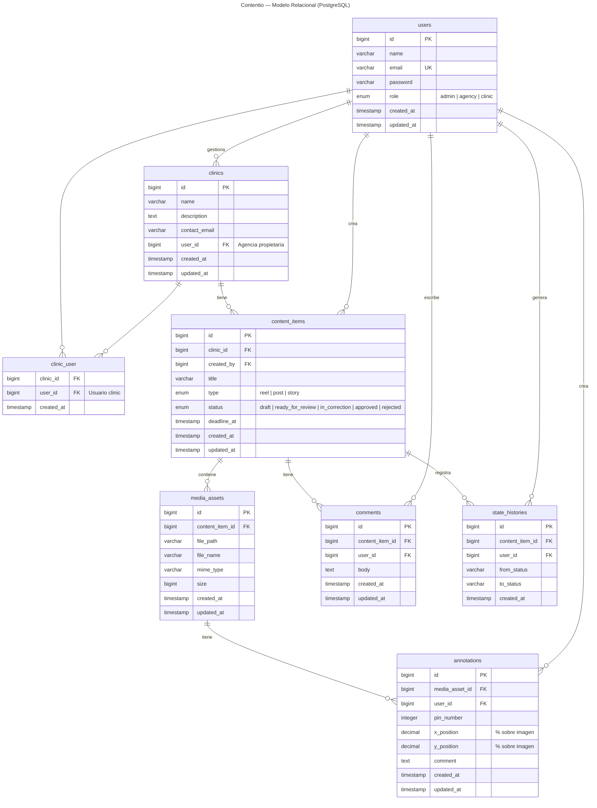

```mermaid
---
title: Contentio — Modelo Relacional (PostgreSQL)
---

erDiagram

      users {
          bigint id PK
          varchar name
          varchar email UK
          varchar password
          enum role "admin | agency | clinic"
          timestamp created_at
          timestamp updated_at
      }

      clinics {
          bigint id PK
          varchar name
          text description
          varchar contact_email
          bigint user_id FK "Agencia propietaria"
          timestamp created_at
          timestamp updated_at
      }

      clinic_user {
          bigint clinic_id FK
          bigint user_id FK "Usuario clinic"
          timestamp created_at
      }

      content_items {
          bigint id PK
          bigint clinic_id FK
          bigint created_by FK
          varchar title
          enum type "reel | post | story"
          enum status "draft | ready_for_review | in_correction | approved | rejected"
          timestamp deadline_at
          timestamp created_at
          timestamp updated_at
      }

      media_assets {
          bigint id PK
          bigint content_item_id FK
          varchar file_path
          varchar file_name
          varchar mime_type
          bigint size
          timestamp created_at
          timestamp updated_at
      }

      comments {
          bigint id PK
          bigint content_item_id FK
          bigint user_id FK
          text body
          timestamp created_at
          timestamp updated_at
      }

      annotations {
          bigint id PK
          bigint media_asset_id FK
          bigint user_id FK
          integer pin_number
          decimal x_position "% sobre imagen"
          decimal y_position "% sobre imagen"
          text comment
          timestamp created_at
          timestamp updated_at
      }

      state_histories {
          bigint id PK
          bigint content_item_id FK
          bigint user_id FK
          varchar from_status
          varchar to_status
          timestamp created_at
      }

      users ||--o{ clinics : "gestiona"
      users ||--o{ clinic_user : ""
      clinics ||--o{ clinic_user : ""
      clinics ||--o{ content_items : "tiene"
      users ||--o{ content_items : "crea"
      content_items ||--o{ media_assets : "contiene"
      content_items ||--o{ comments : "tiene"
      content_items ||--o{ state_histories : "registra"
      media_assets ||--o{ annotations : "tiene"
      users ||--o{ comments : "escribe"
      users ||--o{ annotations : "crea"
      users ||--o{ state_histories : "genera"
```
